# FunTime-Celebrations

## Get to know us 

- FunTime Celebrations is a party organising service for parents. Whether it is a birthday anniversary or a special event, we are here to bring all visions to life, taking the stress away from you. 
- With years of experience and a passion for creating unforgettable experiences, we handle everything from decorations to entertainment, ensuring that all events are memorable and stress-free.
- On our website you can find a wide range of services, contact information and a booking form, view photos from past events and discover how we can make your next celebration truly special!

# GitHub User Story Project

A [project](https://github.com/users/IrinaAdeniyi/projects/4/views/1) containing user stories with acceptance criteria and tasks was created in GitHub. This was done to easily organize and prioritize work, as well as defining clear requirements and tracking progress.

# Wireframes

The wireframes for this website were created using [Balsamiq](https://balsamiq.com/education/)

## Home Page
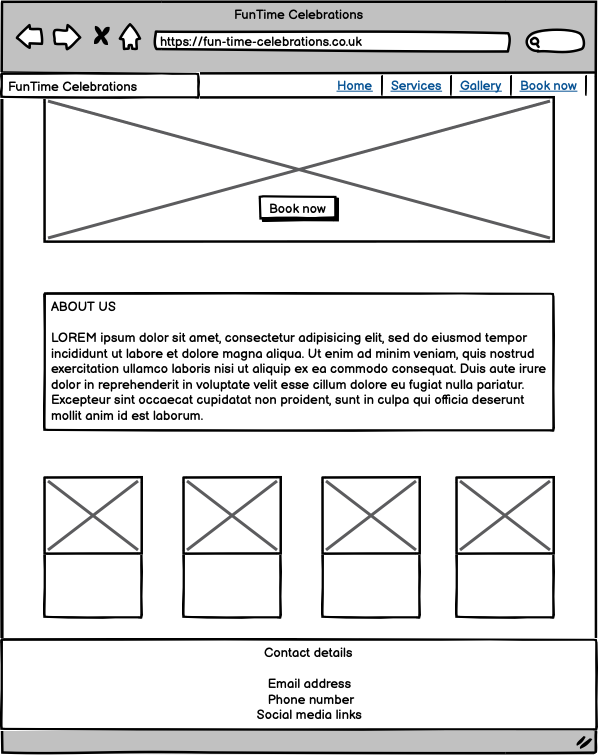
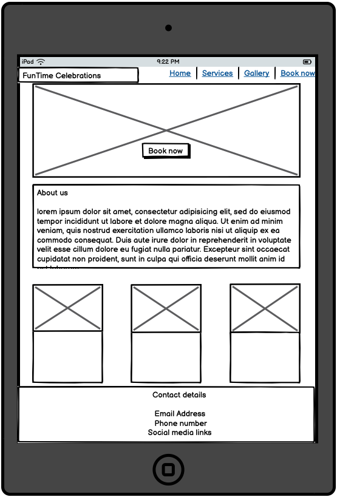
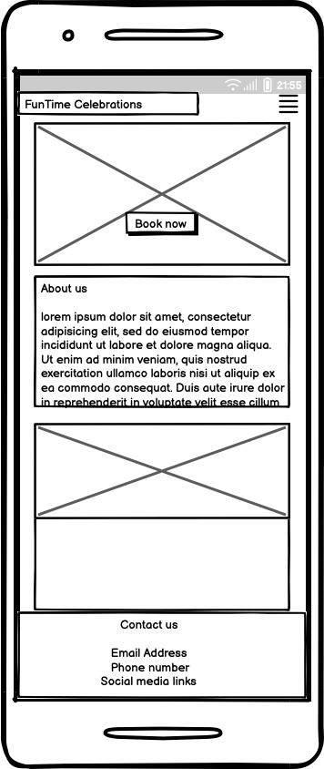

## Services Page
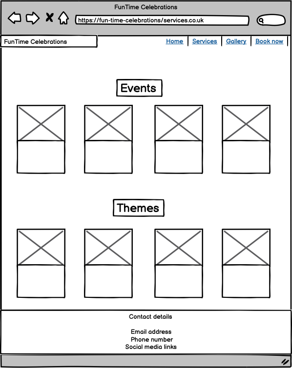
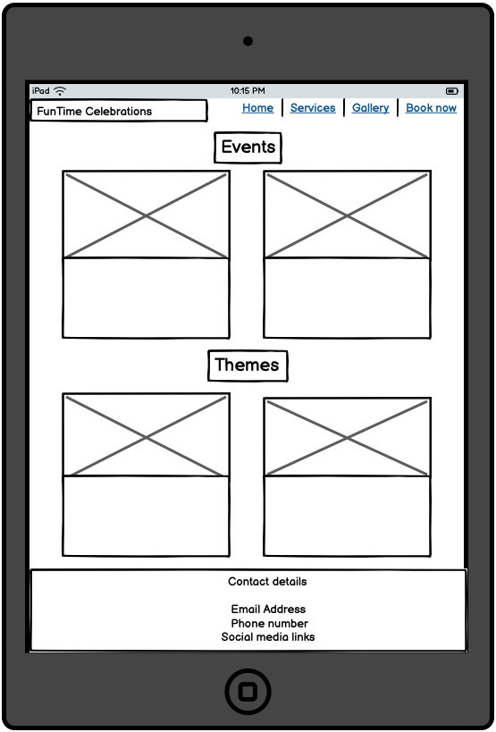
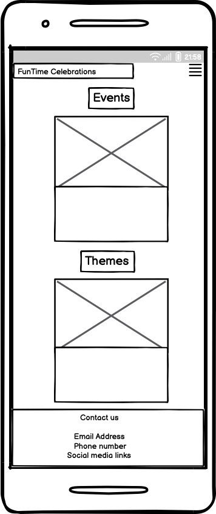

## Gallery Page
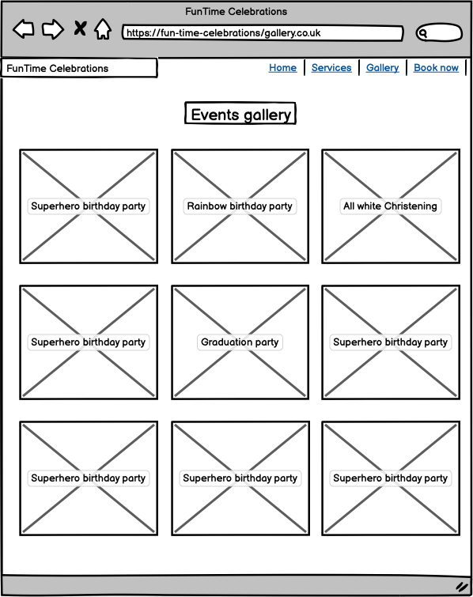
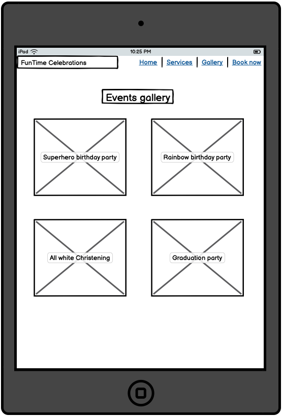
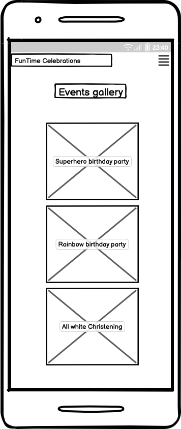

## Book Now Page
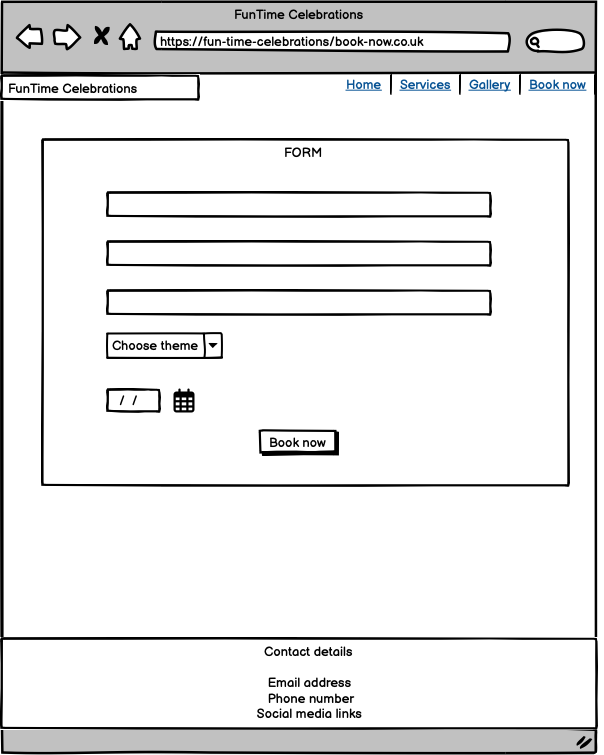
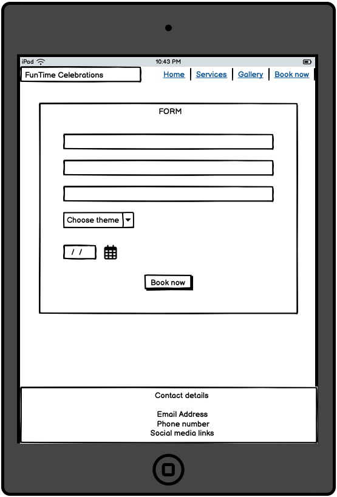
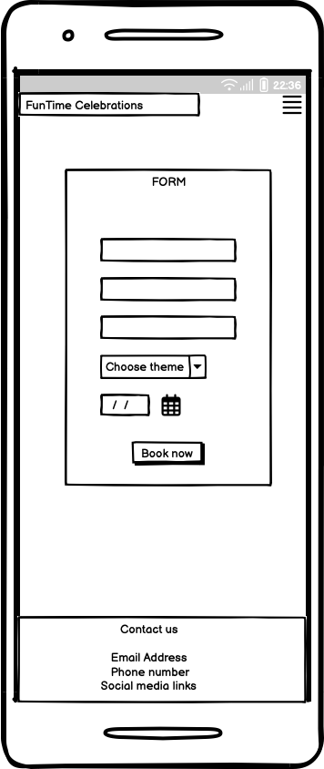

# Building process
1. I started the project by creating the index.html and adding some of the links required in the project: meta links, favicons, CSS stylesheet, Bootstrap links, font awesome. I then created the layout of the home page.

2. I then created the navigation bar and the remaining pages.

3. I continued with the footer and played with some color options.

# Features

# Testing 
Detailed testing was done on the website to ensure the website works properly.

| Feature    | Expected behaviour | Outcome  |
| -----------|:------------------:| --------:|
| Header     | Looks good in all screen sizes|  Works as expected        |
| Logo       | On click takes you to home page                   | Works as expected         |
| Navigation bar | Active page bold, colapse on phone size       | Works as expected         |
|

# Troubleshooting
1. I had an initial issue with the favicon, as I was unsure how to create a new one for my website. After reading the documentation I was able to add the right favicon for my website and make it work.

2. I encountered an issue with the navbar position, but after carefully reading the documentation on Bootstrap it was resolved.

3. I struggled to position the text in the footer (Contact section) - but was resolved reading documentation. 

4. While styling the navbar, the CSS I used to change the text colour in the navbar overrode the *active* class from Bootstrap. After researching I managed to find the solution by targeting the *active* class and giving it a different colour and style them bold.

5. I discovered I used a redundant class for the hero section and rectified the mistake.

6. The *About us* section on the home page kept showing next to the hero section. I managed to resolved this by using the flex-column class from Bootstrap.

7. 

# Remaining bugs

# Website checks using validation tools

# Deployment

# Credits
