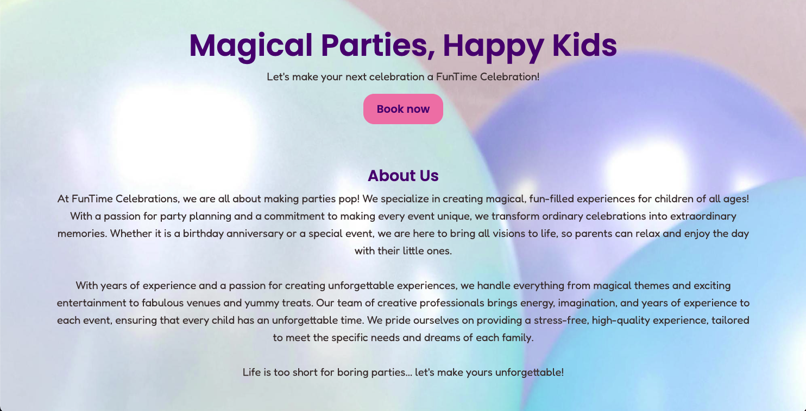
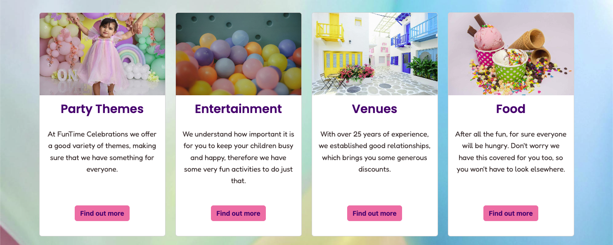
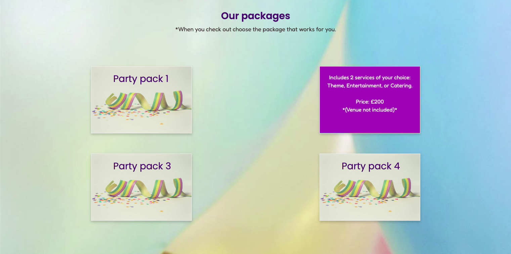
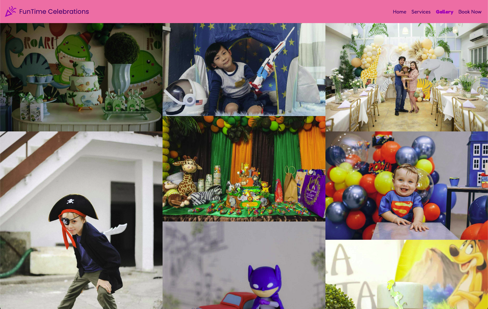
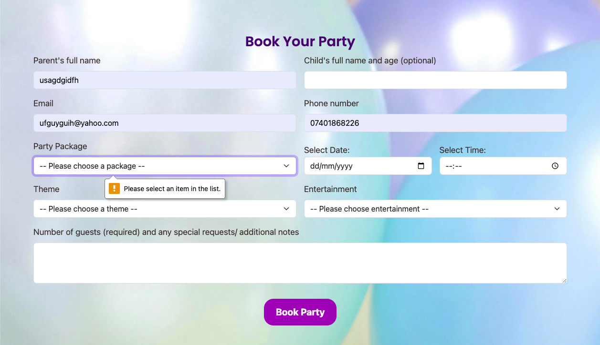
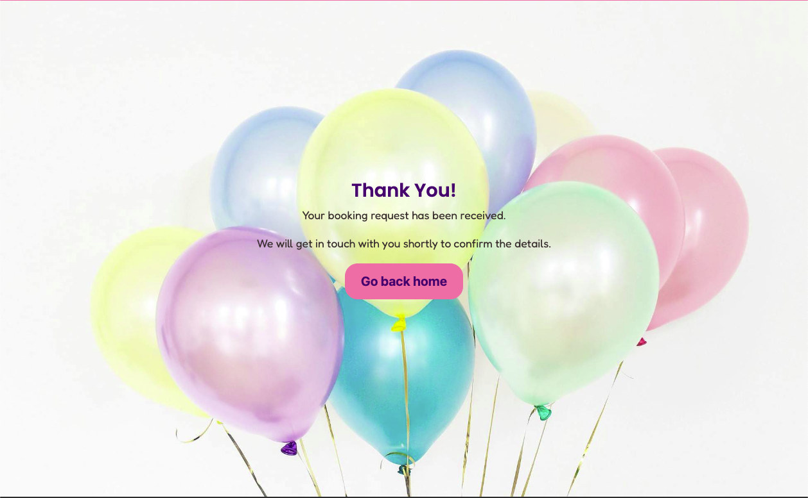

# 🎉FunTime-Celebrations

## Get to know us 

- A responsive, multi-page website built with HTML, CSS, and Bootstrap, showcasing fun and vibrant party themes for children’s celebrations. The project includes a gallery, service descriptions, and booking information, optimized for both desktop and mobile devices.
- FunTime Celebrations is a party organising service for parents. FunTime Celebrations offers the following services: themed parties, various entertainments, options for venues and catering, through different packages. 

##  🚀  Live Demo

👉 View the website [here]()

## 🛠 Technologies Used

HTML5

CSS3

Bootstrap 5

## GitHub User Story Project

A [project](https://github.com/users/IrinaAdeniyi/projects/4/views/1) containing user stories with acceptance criteria and tasks was created in GitHub. This was done to easily organize and prioritize work, as well as defining clear requirements and tracking progress.

## Wireframes

The wireframes for this website were created using [Balsamiq](https://balsamiq.com/education/)

*Disclaimer: The wireframes shown are for demonstration purposes only. The final implementation may vary from these initial representations.

### Home Page

### Services Page

### Gallery Page

### Book Now Page

## Building process
1. I started the project by creating the index.html and adding some of the links required in the project: meta links, favicons, CSS stylesheet, Bootstrap links, font awesome. I then created the layout of the home page.

2. I followed with the navigation bar and I created the remaining pages, adding the navbar, the boilerplate structure and the footer on each page.

3. I played with some color options to find something that I would like.

4. I then added the header and the *About us* section.

5. I proceeded to work on the *Services* section on the *Home* page.

6. I further styled the navbar and made the page responsive on mobiles and tablets. I finally tested the home page and moved to the next page *Services*.

7. On the services page I firstly added the background photo and text for each service: themes, entertainment, venues and food.

8. I then investigated how I can add some flip cards to present the offered packages. I struggled to make it work with Bootstrap, but managed to use some advice some W3Schools and make the cards flip.

9. I tested the *Services* page's links and responsiveness and made the necessary corrections.

10. As the *Gallery* page was a *should-have* page, I decided to continue with the booking form page, which was a *must-have*.

11. For the *Book Now* page I used a Bootstrap Form and added field for personal details like name and age, for email and phone number. I used dropdowns for *Party Package*, *Date and Time*, *Theme*, and *Enterntaiment*. Finally, I choose a textbox which requires the number of guests and offers flexibility to add any other requests or comments.

12. I continued by adding the background of the page, the title of the page and the booking button.

13. Once the *Book Now* page was fully responsive, I created a *Confirmation* page, to present the user with, once they press the *Book Party* button.

14. I styled the *Confirmation* page to fit with the rest of the website: it has a navbar and footer, a background picture, a button matching the othe rbuttons on the website and same fonts as the rest of the website.

15. The button on this page takes the user back to the home page.

16. Finally, I created the *Gallery* page. This page was created by using the *img-fluid* bootstrap class.

17. Once I completed the website, I checked that all links and buttons work as expected. I then tested for responsiveness on all pages and made the necessary adjustments. 

18. Once I finalised the manual checks, I used tools like HTML and CSS validators, as well as the Lighthouse feature in Chrome DevTools. The lighthouse tool higlighted some issues that were resolved to the best of my ability.

19. Finally the README file was updated - this was also updated throughout the development process.

## 📂 Project Structure
- **assets/**: Contains the static files for the website.
  - **css/**: The folder containing the main styles for the site (style.css).
  - **images/**: Contains all images for the website, with subfolders for the favicon, gallery and logo images.
- **HTML files**: The main content pages of the website:
  - `book-now.html`: The booking page.
  - `confirmation.html`: The confirmation page after booking.
  - `gallery.html`: The page displaying the gallery.
  - `index.html`: The homepage.
  - `services.html`: The page showcasing the services.

## Features
1. Navbar with logo and links to different pages

- The navbar is responsive on all devices (burger on small screens). 

- The *active* class from Bootstrap was used to highlight the current page. 

- The logo takes you to the home page.

2. Hero and About Us sections on home page

- The hero section has a playful title and paragraph, as well as a button to the booking page.

- The About Us section introduces the user to what we do and our experience.

3. Services section on the home page

- This section is fully responsive in all screen sizes (though there is no left and right padding around the "Entertainment" title on 1022px - though I tried to resolve this, due to Bootstrap innate properties I was not able to correct this).

- The title is catchy and the paragraph text is engaging, while the button directs the user to the services page to find out more about what we offer.

4. Flip cards to showcase different party packages

- This section is responsive, however I would have liked to have 4 cards on one row on bigger screens. However, all my efforts to achieve this failed. The cards, on the other hand, still look good on two rows and they are easily readable.

- On hoover the card turns to reveal details about the package.

4. Image gallery for inspiration

- Fully responsive: 1 column on small screens, 2 columns on medium screens and 3 columns on big screens

4. Booking form with form validation

- Fully responsive booking form - can't submit the form without the required information

- When time is selected after I would have liked the dropdown to close, however this doesn't happen. As this is a Bootstrap element, I couldn't do much to change this.

5. Styled confirmation page

- This page is fully responsive and matches the rest of the website.

6. Footer with quick links, contact and social links

- Fully responsive, clean footer

## Testing 
Detailed testing was done on the website to ensure the website works properly.

| Feature    | Expected behaviour | Outcome  |
| -----------|:------------------:| --------:|
| Header     | Looks good in all screen sizes|  Works as expected        |
| Logo       | On click takes you to home page                   | Works as expected         |
| Navigation bar | Active page bold, colapse on phone size, logo only on mobile       | Works as expected         |
| All links in navbar take you to the right page | For example, Book Now akes you to the booking form page | Works as expected
| Abouts us section | Looks good on all screen sizes | Works as expected |
| Services section on home page | Links take you to the services page and cards display properly in all screen sizes | Works as expected
| Services page | Looks good on all screens | Works as expected
| Flip cards | On hoover they flip to reveal more information | Works as expected
| Gallery page | Fully responsive in all screen sizes: 1 column - phones, 2 columns - tablets and 3 columns - laptops and bigger screens | Works as expected
| Booking form page | Fully responsive on all screens | Works as expected
| Form validation | The form cannot be submitted without the required information | Works as expected
| Confirmation page | Fully responsive on all devices and matches the rest of the website | Works as expected
| All buttons and links | Take you to the right place | Works as expected
| Footer | Fully responsive and containing all the necessary information | Works as expected

## Troubleshooting
1. I had an initial issue with the favicon, as I was unsure how to create a new one for my website. After reading the documentation I was able to add the right favicon for my website and make it work.

2. I encountered an issue with the navbar position, but after carefully reading the documentation on Bootstrap it was resolved.

3. I struggled to position the text in the footer (Contact section) - but was resolved reading documentation. 

4. While styling the navbar, the CSS I used to change the text colour in the navbar overrode the *active* class from Bootstrap. After researching I managed to find the solution by targeting the *active* class and giving it a different colour and style them bold.

5. I discovered I used a redundant class for the hero section and rectified the mistake.

6. The *About us* section on the home page kept showing next to the hero section. I managed to resolved this by using the flex-column class from Bootstrap.

7. I had issues with the way the page was scrolling and after investigating I realised I set a height to the hero section, which was interfering with the way the page was displayed - it was cut instead of scrolling.

8. The home page was not showing properly on mobiles and tablets, so I used media queries to adjust how the navbar, text, cards and footer look on these screens.

9. The text on the services cards on the *Services* page was spreading accross the page incontrolably, therefore I added some padding to *inline-block* display to correct this.

10. The flip cards created the biggest issues for me as I was unable to make them flip using Bootstrap cards. I finally used some resources from W3Schools and manage to create them. But the solution from this website  suggested to use *float*, which is affecting responsiveness. I managed to make them look good on all screen sizes, however, I would have preferred to have one row with for cards on big screens, instead of two columns. I tried using display: flex with a few different option (eg justify-content: space-evenly). However, this didn't work either.

## Remaining bugs

## Website checks using validation tools

## Deployment

## Credits
